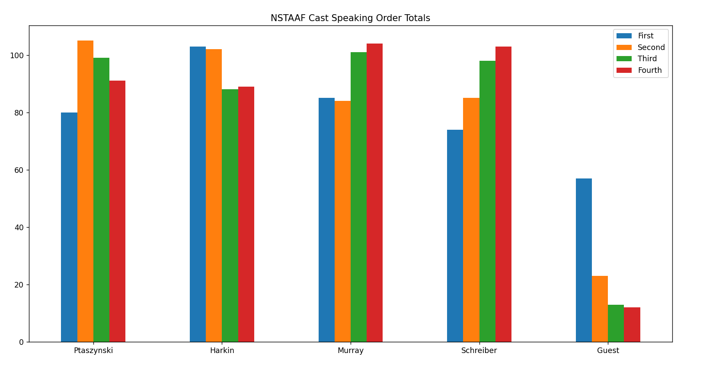
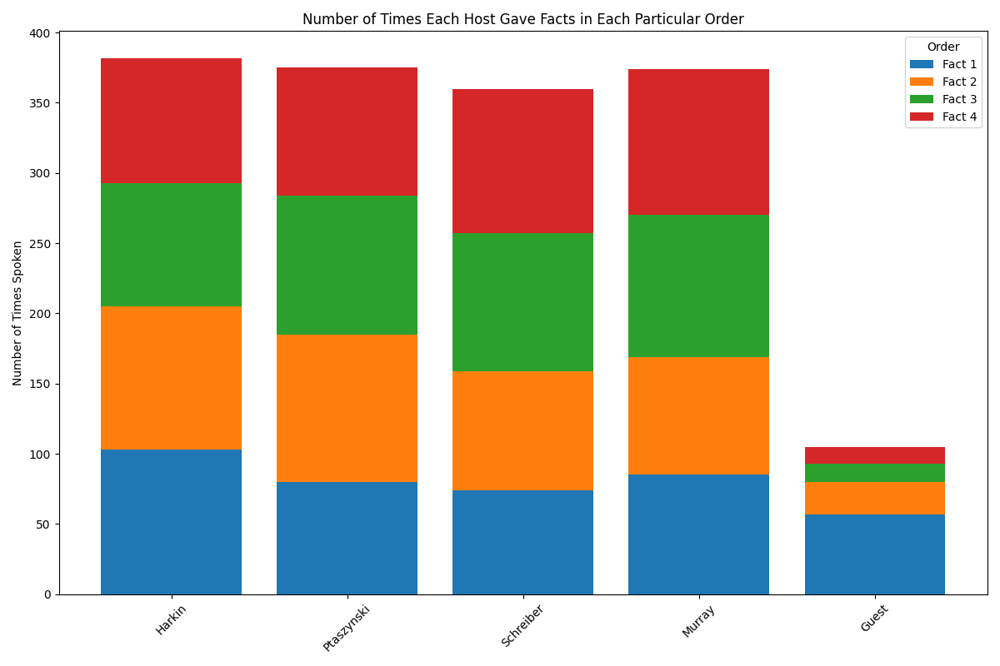
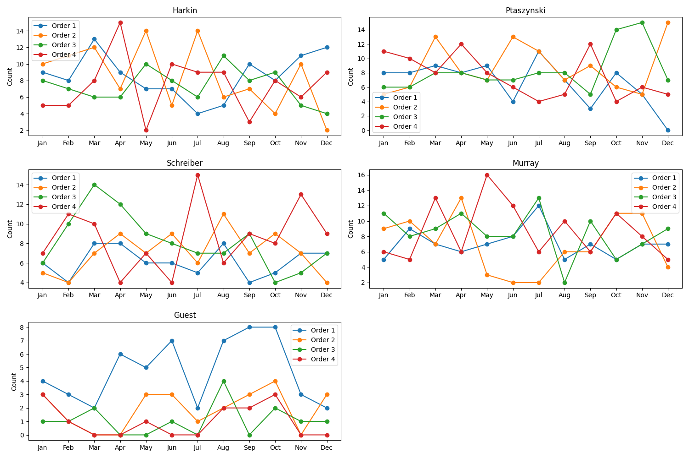
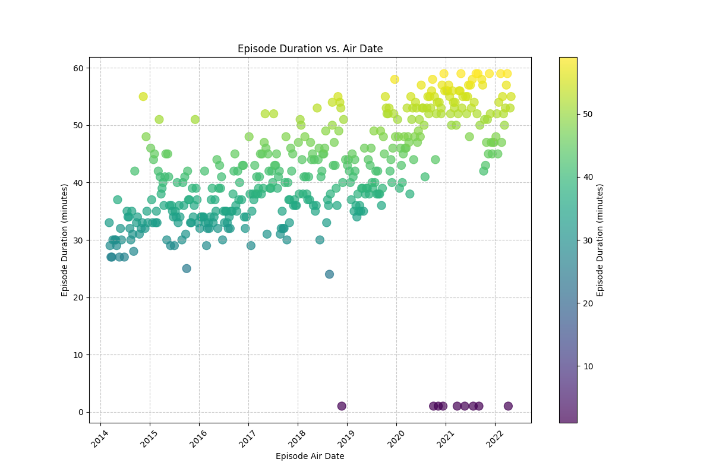
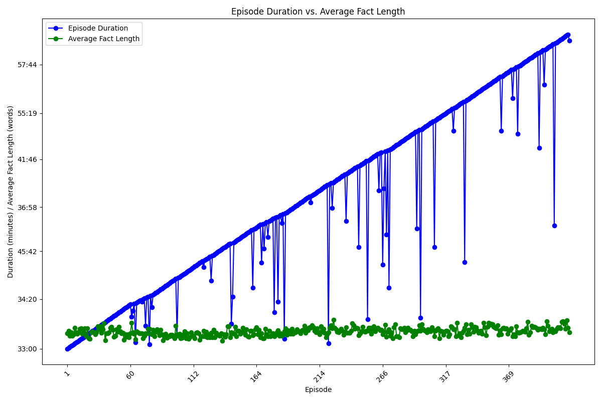
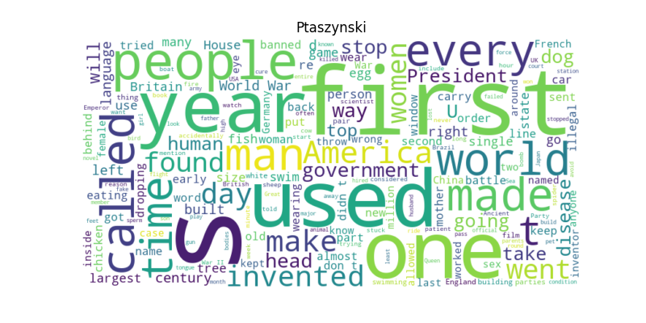
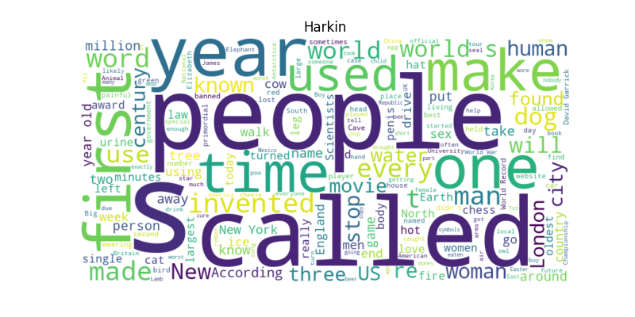
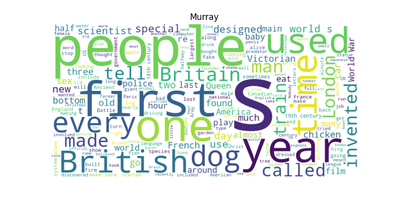
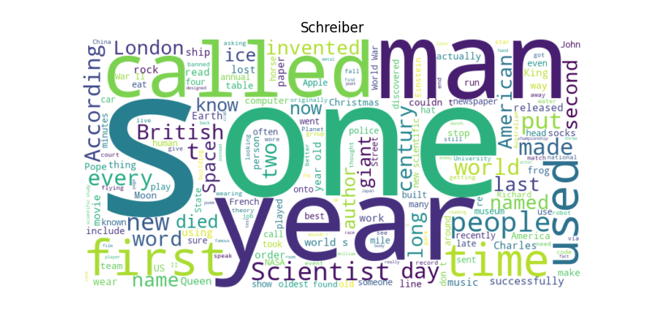
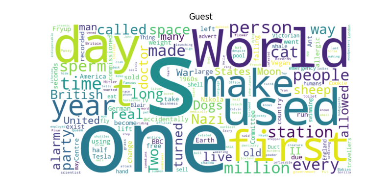

# Analyzing Speaker Order Variability in "No Such Thing As A Fish" Podcast

At the outset of each episode of the podcast No Such Thing As A Fish, the speakers declare that they will begin discussing facts in "no particular order."

To delve into the validity of this claim, data was collected from the [NSTAAF wiki](https://nstaaf.fandom.com), meticulously capturing information about the speaker order in 424 podcast episodes.

Through these analyses, light is shed on the intricacies of the speaker order dynamics within the podcast. This exploration may reveal patterns, trends, or surprises about how the speakers actually choose to present their facts, and whether there is any method to their "no particular order" madness.

## Chi-Square Analysis: Speakers vs. Speaking Order

A Chi-Square analysis was conducted to examine the association between speakers and their speaking order in episodes of the podcast *No Such Thing As A Fish*. The dataset includes information on which speaker presented facts in each episode.

### Initial Analysis Results

In the initial analysis, considering all speakers, the following results were obtained:

- Chi-Square Statistic: 65.8816072947345
- P-value: 1.8724447966476476e-09

These results indicated a statistically significant association between speakers and speaking order. In other words, there was strong evidence to suggest that speakers were not randomly assigned speaking orders and that certain speakers were more likely to appear in specific positions within episodes.

### Updated Analysis Results (Excluding "Guest")

For the updated analysis, the "Guest" presenter was excluded from the dataset, and the Chi-Square test was performed again. The results were as follows:

- Chi-Square Statistic: 11.587639582281854
- P-value: 0.23756661479553126

Interestingly, the updated analysis showed no statistically significant association between speakers and speaking order when "Guest" was excluded. This suggests that the speaking order of the core speakers (excluding guests) was more evenly distributed and less predictable. In other words, without the presence of guest speakers, the order in which the core speakers presented facts appeared to be more random.

To visualize this difference, some of the graphs below show the distribution of speaking orders for both core presenters and "Guest." It's evident that "Guest" speakers often appear in the 1st speaking order, which contrasts with the more evenly distributed speaking orders for core presenters.

## Project Visualizations

### Total Speaker Order Counts

These bar charts shows the total number of times each speaker presented in each order.

### Speaker Order Over Time

These subplots display how each participant's speaking order evolved over time, across 12 months.

### Duration vs. Air Date

This scatter plot illustrates the relationship between episode duration and air date.

### Duration vs. Average Fact Length

This scatter plot explores the correlation between episode duration and the average length of facts presented.

### Word Clouds

These word clouds visualize the most common words used by each speaker in their facts. (don't ask about the S)

### Acknowledgment

A language model chat assistant was utilized in the development of this project for guidance and assistance.
