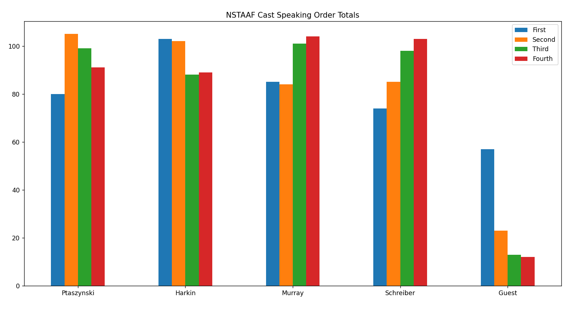
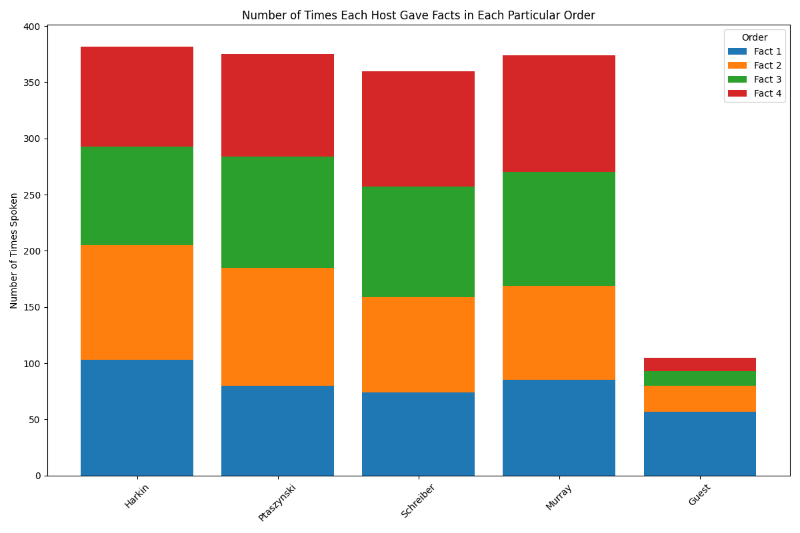
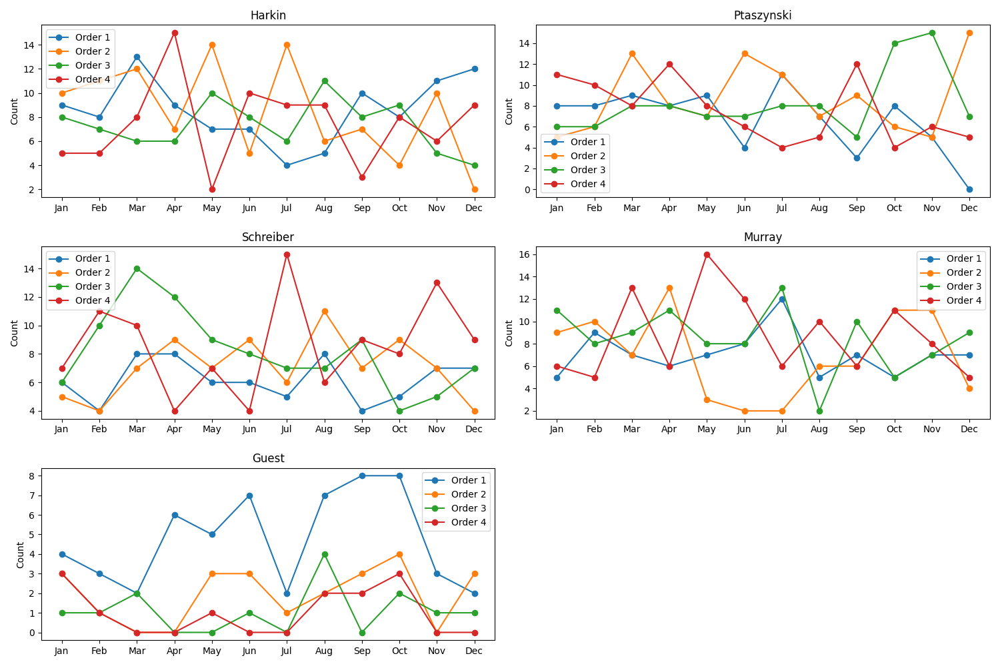
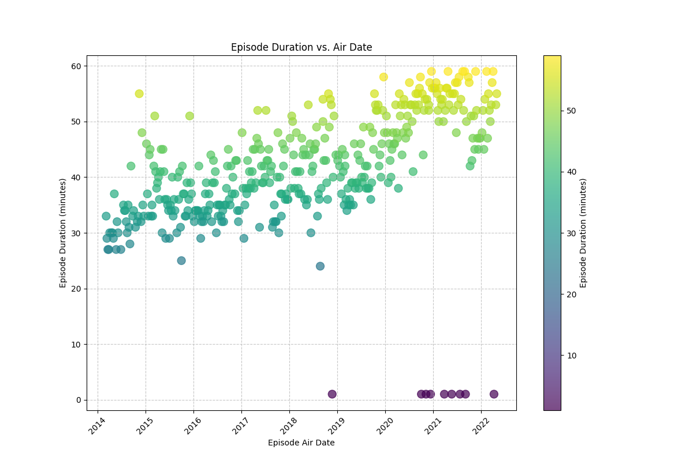
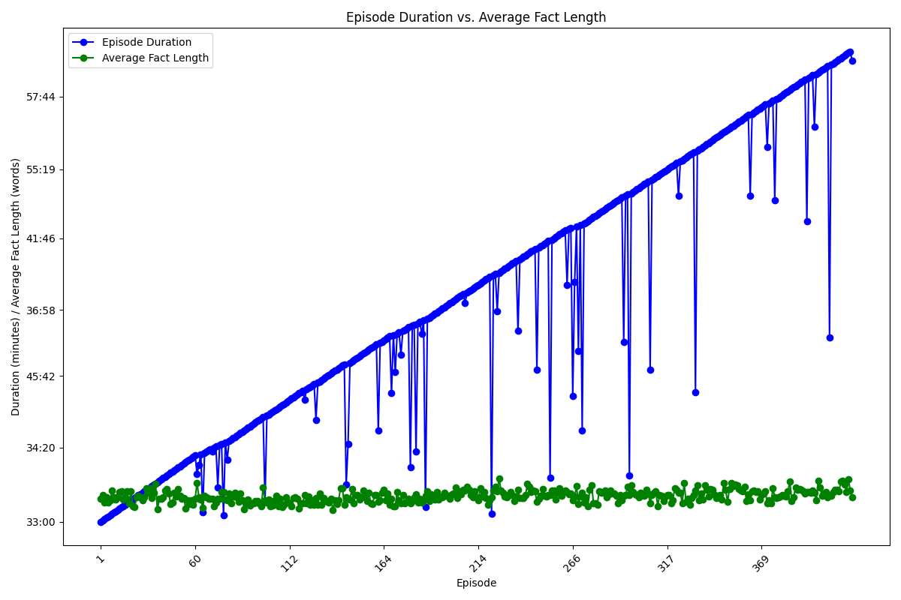
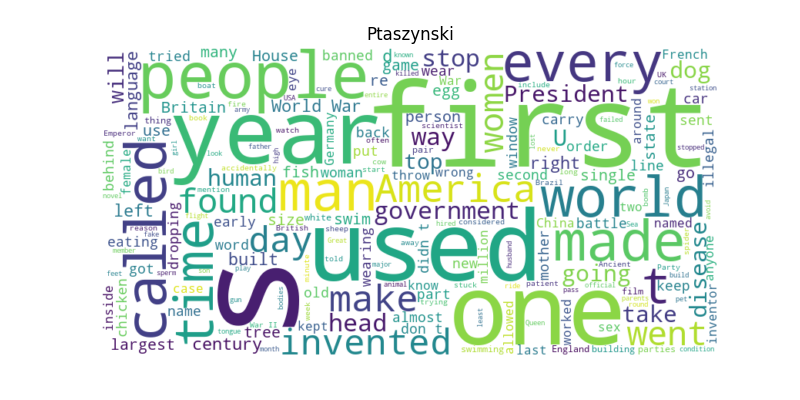
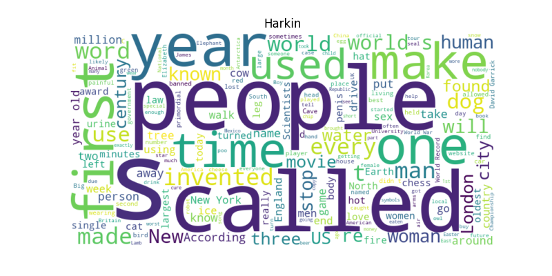
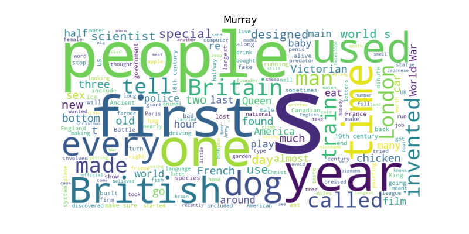
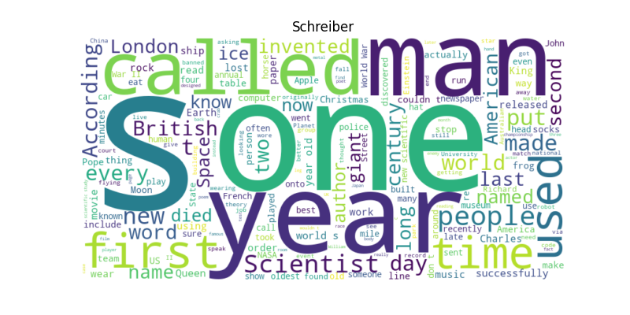
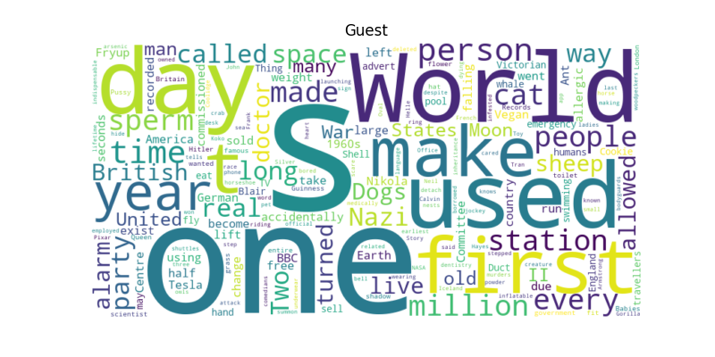

# Is "No Such Thing As A Fish" actually in no particular order?

Every episode of *No Such Thing As A Fish* opens with the hosts declaring they'll present their facts in "no particular order." This project scrapes 399 episodes (March 2014 - April 2022) from the [NSTAAF wiki](https://nstaaf.fandom.com) and checks whether that's actually true.

## The short answer

For the four main hosts — mostly yes. A chi-squared test on just Harkin, Ptaszynski, Murray, and Schreiber gives a p-value of 0.24, meaning there's no statistically significant pattern in who goes when. Their speaking positions are roughly evenly distributed.

But include guest speakers and the picture changes (p-value drops to ~1.9e-09). Guests go first **54% of the time** — way more than the expected 25%.

## The graphs

### Who goes where

The core four hosts are spread pretty evenly across all four positions. Harkin has a slight lean toward going first (103 times vs ~85 average), and Schreiber tends toward the back half, but neither is dramatic. Guests are the outlier — heavily skewed toward Fact 1.





### Speaking order by month

Breaking it down by calendar month, there aren't any obvious seasonal patterns. The lines are noisy and criss-cross constantly, which is what you'd expect if the order is genuinely close to random.



### Episodes are getting longer

Early episodes ran around 30 minutes. By 2022, most are in the 50-60 minute range. The trend is steady and clear — the show has nearly doubled in length over 8 years.



### Episode length vs fact length

Episode duration has gone up over time, but the average word count per fact stays relatively flat. Longer episodes likely mean more discussion and tangents rather than longer fact descriptions on the wiki.



### Word clouds

The most common words in each host's facts. The giant "S" across all of them is an artifact of the wiki formatting (possessives, plurals getting split). Beyond that, everyone talks about "people", "year", and "first" a lot — not exactly surprising for a show about interesting facts.







## Running it yourself

```bash
pip install -r requirements.txt
python scrape_data.py        # re-scrape episode data from the wiki
python chi_squared_test.py   # run the statistical test
python graph_*.py            # generate the graphs
```

Data is scraped from the [NSTAAF Fandom wiki](https://nstaaf.fandom.com). The scraped dataset is included as `fish_episode_info.json` so you don't need to re-scrape to play with the analysis.
